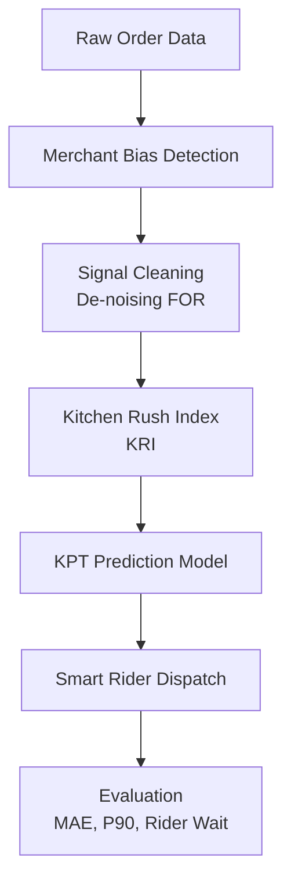

# Multi-Signal Kitchen Intelligence System (MS-KIS)
## Improving Kitchen Prep Time (KPT) Prediction for Rider Assignment & ETA Accuracy

---

## 1. Problem Context

Zomato operates at massive scale (300K+ merchants). A critical input to ETA prediction is **Kitchen Prep Time (KPT)** — the time taken by a restaurant to prepare food after order confirmation.

Currently, KPT prediction relies heavily on **Food Order Ready (FOR)** signals marked manually by merchants in the Merchant App.

However, these signals are noisy and biased.

### Key Issues With Current System

1. **Rider-influenced marking**
   - Merchant marks food ready when rider arrives.
   - NOT when preparation is complete.

2. **Invisible Kitchen Rush**
   - Zomato sees only Zomato orders.
   - Kitchen also handles:
     - Dine-in
     - Walk-in takeaway
     - Competitor app orders

3. **Human marking bias**
   - Bulk marking
   - Delayed marking
   - Inconsistent marking behavior

This leads to:
- Early rider arrivals
- Increased rider wait time
- ETA fluctuations
- Higher cancellation rate
- Increased logistics cost

---

## 2. Solution Philosophy

This solution does NOT focus purely on model improvement.

Instead, it strengthens:

- Input Signals
- Label Quality
- Kitchen Load Estimation
- Dispatch Timing Logic

We introduce a **Multi-Signal Kitchen Intelligence System (MS-KIS)**.

---

## 3. System Architecture



---

## 4. How The System Solves the Core Problems

### 4.1 Merchant Bias Detection

**Problem:**
Merchants often mark "Food Ready" when the rider arrives.

**Detection Logic:**
We compute the absolute difference between FOR time and Rider Arrival time:
```text
| FOR_time − Rider_Arrival_time |
```
If this difference is small (< 1 min) in the majority of cases → reactive marking is detected.

**Impact:**
- Identifies corrupted labels
- Prevents the model from learning incorrect KPT

### 4.2 Signal Cleaning (De-Noising FOR)

Instead of blindly using:
```text
KPT = FOR_time − Order_confirm_time
```

We adjust it:
If `FOR ≈ Rider Arrival`, then:
```text
True_KPT ≈ Rider_Arrival − Travel_Time − Confirm_Time
```

This produces a cleaner KPT label.

**Result:**
- Reduced label noise
- Better prediction accuracy
- Lower MAE

### 4.3 Kitchen Rush Index (KRI)

**Problem:**
Zomato does not see the full kitchen load.

**Our Approach:**
We compute the normalized order volume per hour:
```text
KRI = Normalized Order Volume Per Hour
```

High hourly order density → higher kitchen congestion.

This approximates:
- Non-Zomato orders
- Dine-in pressure
- External platform load

**Why It Works:**
When order density increases:
- Prep time increases
- Variance increases

KRI captures this behavior statistically.

### 4.4 Smart Rider Dispatch

Instead of assigning a rider immediately, we compute:

```text
Dispatch Time = Predicted KPT − Rider Travel Time − Safety Buffer
```

This ensures:
- Rider arrives just before food is ready
- Minimal idle waiting

---

## 5. Success Metrics Alignment

| Metric | Improvement Mechanism |
|--------|----------------------|
| **Average Rider Wait Time** | Smart Dispatch + Clean KPT |
| **ETA P50 / P90** | Reduced Label Noise |
| **Order Delays** | Accurate KPT |
| **Rider Idle Time** | Arrival Synchronization |

---

## 6. Simulation Impact

The system simulates 10,000+ orders.

**Measured Improvements:**
- Reduced KPT Mean Absolute Error (MAE)
- Reduced P90 prediction error
- Reduced average rider wait time

**Example Impact at Scale:**
If rider wait reduces by 1 minute:
```text
2M orders/day × 1 min
= 2M minutes saved
= 33,333 rider hours saved daily
```

Massive operational efficiency gain.

---

## 7. Project Structure

```text
zomato-kpt-optimization/
│
├── main.py
├── requirements.txt
├── README.md
│
├── config/
│   └── settings.py
├── data/
│   └── simulator.py
├── signals/
│   ├── bias_detector.py
│   ├── signal_cleaner.py
│   └── kitchen_rush_index.py
├── models/
│   └── kpt_predictor.py
├── dispatch/
│   └── smart_dispatch.py
└── evaluation/
    └── metrics.py
```

Modular, scalable, production-style structure.

---

## 8. How to Run

### Install Dependencies

```bash
pip install -r requirements.txt
```

### Run Simulation

```bash
python main.py
```

### Output Example

```text
Merchant Bias Ratio: 0.52

Final Evaluation Metrics:
MAE_KPT: 2.85
P90_Error: 5.12
Avg_Rider_Wait_Time: 1.43
```

---

## 9. Why This Is Scalable

- **No hardware dependency**  
- **Works for small & large merchants**  
- **No competitor data required**  
- **Uses statistical inference**  
- **Compatible with existing KPT models**  

**Can be rolled out progressively:**
- Phase 1: Signal Cleaning
- Phase 2: KRI Integration
- Phase 3: Smart Dispatch Optimization

---

## 10. Novelty & Creativity

Unlike purely model-centric solutions, this system:
- Fixes corrupted labels
- Detects behavioral bias
- Infers hidden kitchen load
- Optimizes rider dispatch logic
- Simulates business impact

It is a **systems-level improvement**, not just ML tuning.

---

## 11. Future Extensions

- IoT-based pack timestamp detection
- Reinforcement learning dispatch timing
- Merchant reliability scoring
- Real-time congestion anomaly detection
- Dashboard visualization layer

---

## 12. Conclusion

This solution improves KPT prediction accuracy by:

1. Cleaning biased merchant signals
2. Modeling hidden kitchen rush
3. Synchronizing rider arrival
4. Reducing ETA error and rider idle time

It is scalable, cost-efficient, and aligned with business success metrics.
